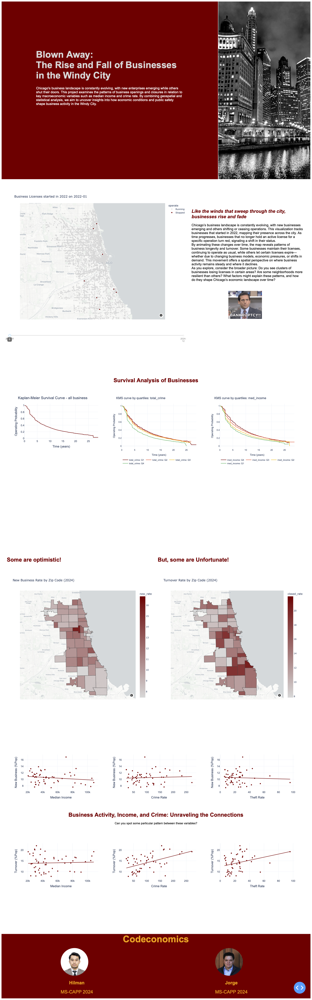

# Blown Away: The Rise and Fall of Businesses in the Windy City by Codeconomics
 
## Members
 
- Hilman Hanivan <hanivan@uchicago.edu>
- Jorge Guerrero <jguerrero95@uchicago.edu>
 
## Abstract
 
This project examines the patterns of business openings and closures in relation to key macroeconomic variables such as median income and crime rate. By combining geospatial and statistical analysis, we aim to uncover insights into how economic conditions and public safety shape business activity in Chicago. The work informs policy making on businesses trends in the city of Chicago. The project uses data from businesses licenses and crime events from the Chicago Data Portal (https://data.cityofchicago.org) and median income data from the US Census Bureau (https://www.census.gov). 
 
 
## How to Run
 
Step 1) Run `uv sync` to synchronize the libraries.
 
Step 2) Set API Key in your terminal. For example: `$ export API_KEY="your_API_KEY"`
 
Step 3) Run `uv run -m business` to get the data, clean it and analyze it
 
Step 4) Run `uv run -m business.app` to make the visualizations
 
## Visual output example

 
## Data Sources
- Data Source #1: Business Licenses issued by the Department of Business Affairs and Consumer Protection in the City of Chicago from 2002 to the present. **URL**: https://data.cityofchicago.org/Community-Economic-Development/Business-Licenses/r5kz-chrr/about_data
- Data Source #2: American Community Survey (ACS). **URL**: https://www.census.gov/programs-surveys/acs
 
- Data Source #3: Crimes - 2001 to Present. **URL**: https://data.cityofchicago.org/Public-Safety/Crimes-2001-to-Present/ijzp-q8t2/about_data
 
- Data Source #4: Zipcode Boundaries. **URL**: https://data.cityofchicago.org/Facilities-Geographic-Boundaries/Boundaries-ZIP-Codes-Map/gdcf-axmw
