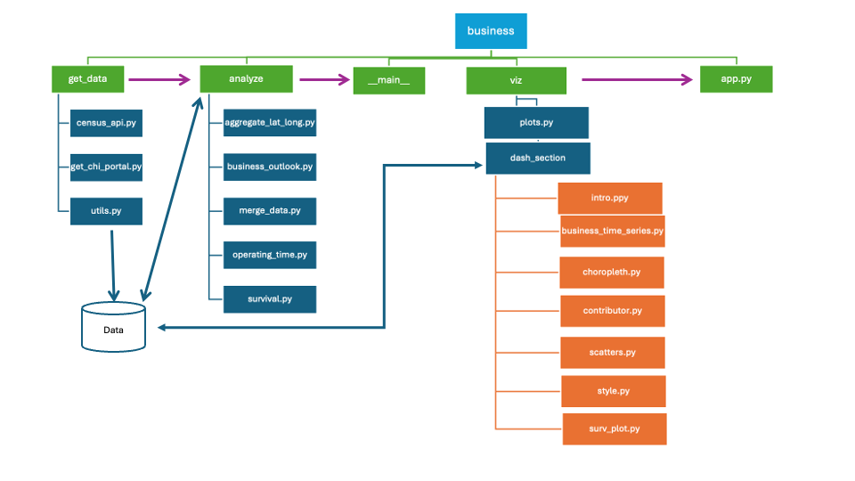
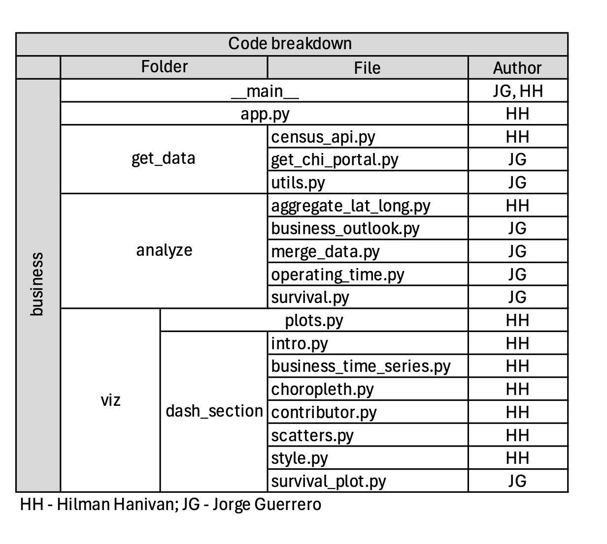

# Blown Away: The Rise and Fall of Businesses in the Windy City by Codeconomics
 
## Members
 
- Hilman Hanivan <hanivan@uchicago.edu>
- Jorge Guerrero <jguerrero95@uchicago.edu>
 
## Abstract
 
This project examines the patterns of business openings and closures in relation to key macroeconomic variables such as median income and crime rate. By combining geospatial and statistical analysis, we aim to uncover insights into how economic conditions and public safety shape business activity in Chicago. The work informs policy making on businesses trends in the city of Chicago. The project uses data from businesses licenses and crime events from the Chicago Data Portal (https://data.cityofchicago.org) and median income data from the US Census Bureau (https://www.census.gov).
 
 
## Data Sources
 
### Data Source #1: Business Licenses
Business licenses issued by the Department of Business Affairs and Consumer Protection in the City of Chicago from 2002 to the present.
- **URL**: https://data.cityofchicago.org/Community-Economic-Development/Business-Licenses/r5kz-chrr/about_data
- **Type**: API. This is a public database that can be requested via API without a APP_KEY
- **Unique key**: Zip Code
- **Challenges**: The database has currently 1.6 million observations, which makes it hard to download or request in one query. The solution was to request the information in an ordered manner by zip code and cached to the project, this reduced the number of requests and ensured to gather all data. A second challenge of the administrative data was to follow the same business over time, which was possible using the unique business key ‘license_number’. 
- **How it is used**: The data is used to calculate duration times of each business with a license. The duration of the business is calculated as the difference in dates of the last expiration date the business appears to the initial date. If the last expiration date is beyond February 2025, the business is considered to remain open. This duration and status of whether the business closed is later used in the survival curves analysis. 
This data is also used to calculate new and closed businesses in each zip code, which are treated as rates to make them comparable among zip codes.

### Data Source #2: American Community Survey (ACS)  
The American Community Survey (ACS) is an ongoing survey that provides vital information on a yearly basis about the USA population. The ACS provides information on jobs and occupations, educational attainment, veterans, whether people own or rent their homes, and other topics.
 
- **URL**: https://www.census.gov/programs-surveys/acs
- **Type**: API. The user must get an API Key from the US Census Bureau in: https://api.census.gov/data/key_signup.html
- **Unique key**: Zip Code
- **Challenges**: After a closer examination, there exists one zip code (60666) missing from this dataset. That being said, we have median income estimates for 58 zip codes in the Chicago area.
- **How it is used**: We retrieve median income data by zip code from this source, which is merged with licenses data by zip code to assess its influence on new and closed businesses as well as rate of closing businesses.
 
### Data Source #3: Crimes - 2001 to Present
This dataset reflects reported incidents of crime (with the exception of murders where data exists for each victim) that occurred in the City of Chicago from 2001 to present, excluding the most recent seven days. 
 
- **URL**: https://data.cityofchicago.org/Public-Safety/Crimes-2001-to-Present/ijzp-q8t2/about_data
- **Type**: API. This is a public database that can be requested via API without a APP_KEY
- **Unique key**: Zip Code (after cleaning)
- **Challenges**: The database has currently 1.06 million observations, which makes it hard to download or request in one query, the solution was to request it by year for the years of interest. The second challenge was that the data does not contain a zip code variable, only longitude and latitude, thus it was processed to locate each observation in a zip code polygon.
- **How it is used**: We retrieved the data by year and used pagination to be able to retrieve the data for the years of interest. Then the number of events were aggregated by type and zip code to be merged with the licenses data by zip code to assess its influence on new and closed businesses as well as rate of closing businesses. In the final visualization, we drop zip codes that have crime rate higher than 1000 cases/1000 individuals which are 60602, 60603, 60604 which are commercial areas and all have very little population size.
 
### Data Source #4: Zip Code Boundaries
Dataset with 62 rows of polygons of zip codes in Chicago. 
- **URL**: https://data.cityofchicago.org/Facilities-Geographic-Boundaries/Boundaries-ZIP-Codes-Map/gdcf-axmw
- **Unique key**: Zip Code
- **Challenges**: After close examination, two zip codes appear twice from the original source (60643 and 60707). This results in analyzing 59 zip codes in Chicago, two with separated polygons.
- **How it is used**: The polygon data is crossed with the latitude and longitude variables of crime data set to determine the zip code of each event. This allows us to merge crime data by zip code to our other data sets.

## Project structure
The project consists of 3 main modules: **get_data, analyze, viz**. The  `get_data` module contains the functions to retrieve data from licenses, crime and income. The file `data` is used to store all requests (previous done requests are stored in `data/cached`, we advise to delete the cash once every 2 months to get more updated data) and processed data CSVs. The `analyze` module processes the raw data to calculate duration time, status and stats by zip code. This portion also prepares and merges data from the different sources. The `viz` module contains the function `plots.py` to make the plots and the submodule `dash_section` that contains the different sections that are rendered with package dash by calling file `app.py`. The following diagram illustrates the structure:

## Team responsibilities 
The following table provides the detailed breakdown of the code’’ author.

## Final thoughts 
The primary objective of Blown Away: The Rise and Fall of Businesses in the Windy City was to explore the relationship between business dynamics—openings and closures—and macroeconomic conditions such as crime rates and median income levels in Chicago. By leveraging statistical and geospatial analysis, we sought to provide insights that could inform policy decisions and help businesses make more strategic location choices. 
Overall, the project successfully achieved these goals. We were able to construct a robust dataset that merges multiple sources, apply analytical techniques to assess business survival rates, and build visualizations to illustrate patterns across different zip codes.
This project was a valuable learning experience in working with large-scale public datasets, handling geospatial data, and applying analytical methods to real-world economic issues. The findings contribute to understanding the challenges faced by businesses in Chicago and offer a foundation for further policy discussions. The work could be extended. For instance, future work could be done on analyzing industry-specific patterns and for modeling policy recommendations outcomes.

